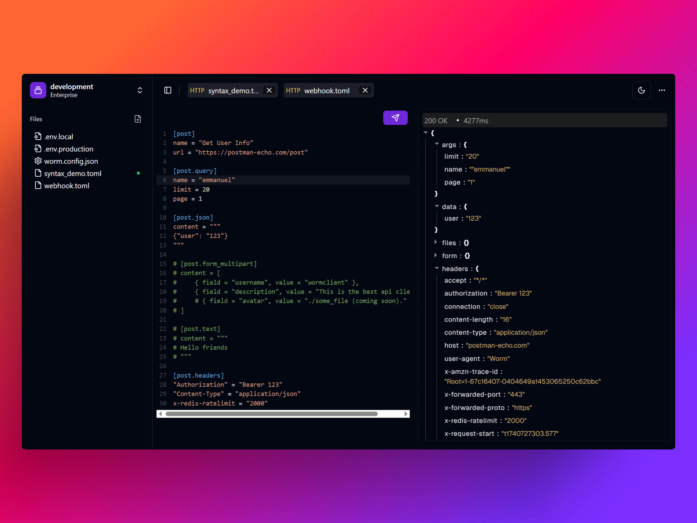

# Worm - Privacy-Focused, Offline-First API Client

<div align="center">
  
</div>

## Why Another HTTP Client?

Worm is an **open-source**, **offline-first** HTTP client built with **Tauri** for developers who value **privacy** and **local-first** workflows with an incredible developer experience (DX). Designed to keep your data private and under your control, Worm allows you to interact with APIs in the best way possible, with optional support for cloud integrations for additional tools like **vaults** and **observability**. Whether you’re working solo or within a team, Worm provides a streamlined and powerful API testing experience.

---

## Installation | Windows

### Requirements

- Windows 10 (64-bit) or later

### Installation from Installer

Simply download and execute the installer, available on the [releases](https://github.com/emee-dev/useworm/releases) page. Currently, there are no official releases, as the project is still in its prototyping phase with ongoing changes. However, you can clone the project and compile it yourself. Refer to the [Tauri v2 documentation](https://v2.tauri.app/) for guidance.

---

## Key Features

- **TOML Syntax:** Make HTTP requests using TOML, making it easy to read, write, and version control with Git.
- **Low Memory Utilization:** Built with Tauri, ensuring optimal performance and minimal resource consumption.
- **Team Collaboration:** Utilize Git for version control and seamless collaboration.
- **Lightweight & Fast:** Designed to be simple, intuitive, and quick to load.

---

## Developing with Worm

Before you begin, ensure you have installed the necessary tools:

- [Rust & Cargo](https://rustup.rs/)
- [Node.js](https://nodejs.org/en)
- Tauri CLI: `cargo install tauri-cli`

### Clone the Repository

```sh
git clone https://github.com/emee-dev/useworm
```

### Install Dependencies

```sh
npm install
```

### Run Worm in Development Mode

```sh
cargo tauri dev
```

You are now ready to start developing!

---

## Notes

- Currently, Worm does not use any platform-specific API and only supports Windows.
- The `src` folder contains the React.js code for the UI, while `src-tauri` contains the Rust backend code.

---

## Roadmap

As Worm is still in beta, several features and improvements are planned. Here’s an overview of upcoming features:

- [x] Request and Response Handling
- [ ] Postman Collection Support
- [ ] Insomnia Collection Support
- [ ] Worm Collections (Folder & File Structure Management)
- [ ] Secret Management
- [ ] Scripting Capabilities
- [ ] GraphQL Support
- [ ] Code Generation
- **Package Distribution:**
  - [ ] Windows Binary
  - [ ] Homebrew Support
  - [ ] Chocolatey Support
- **Authentication:**
  - [ ] Bearer & Basic Authentication
- [ ] OpenAPI 3.0 Imports

---

## TOML Syntax

Worm allows making requests using TOML syntax. Below are some examples:

### GET Requests

```toml
[get]
name = "Get User Info"
url = "_.base_url/users/_.user_id"
```

### POST Requests

```toml
[post]
name = "Create User"
url = "_.base_url/users"

[post.json]
content = """
{
    "userId": "jae",
    "email": "email@gmail.com"
}
"""
```

### Request Bodies

```toml
[get.json]
content = """
{
    "userId": "jae",
    "email": "email@gmail.com"
}
"""

[get.form_data]
content = [
    { field = "file", value = "./path/to/file.txt" },
    { field = "user_name", value = "jet" }
]

[get.form_urlencoded]
content = [
    { field = "title", value = "New Post" },
    { field = "content", value = "This is the content of the new post." },
    { field = "tags", value = "example,post" }
]

[get.xml]
content = """
<post>
  <title>New Post</title>
  <content>This is the content of the new post.</content>
  <tags>
    <tag>example</tag>
    <tag>post</tag>
  </tags>
</post>
"""

[get.text]
content = """
This is a request type of body text. Very concise.
"""
```

### Request Scripts

```toml
[get.pre_request]
code = """
console.log("Hello world.");
"""

[get.post_request]
code = """
console.log("Hello world.");
"""
```

### Query Parameters

```toml
[get.query]
id = "emee"
page = 10
limit = 30
```

### Headers

```toml
[get.headers]
Authorization = "_.auth_token"
Accept = "application/json"
```

**Note:** The syntax is experimental and subject to change based on feasibility, DX, and other factors.

---

## Pricing

The pricing model is still undecided. The plan is to open-source the application while offering licenses for teams and organizations. The sustainability of Worm will rely on team and organization plans. If you have suggestions regarding pricing and licensing, feel free to share your thoughts.

---

## Contributing 💬

Contributions of all kinds are welcome! Whether it's fixing bugs, adding features, sharing feedback, starring the repo, or improving documentation, feel free to open an issue or submit a pull request.

Thank you for your support! 🚀

---

## Support My Work ☕

If you find Worm useful, consider supporting my work:

[](https://buymeacoffee.com/emee_dev)

---

## Connect with Me 🌐

- **X (formerly Twitter):** [@_\_\_emee_](https://x.com/___emee_)
